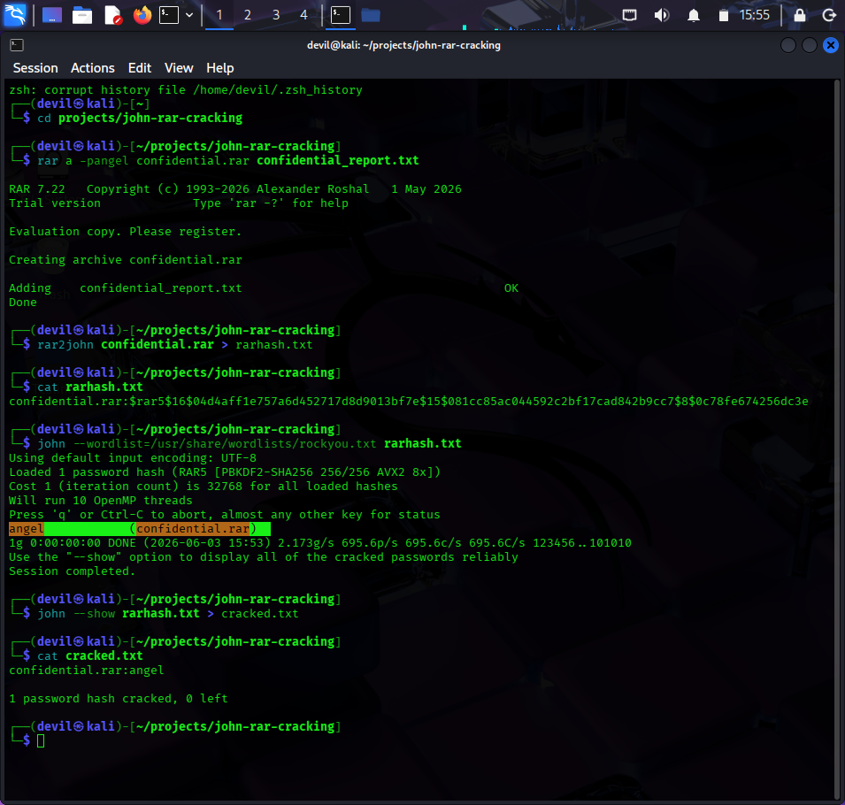

# RAR Password Cracking Using John the Ripper

## Objective
To crack a password-protected RAR file using John the Ripper and a dictionary attack.

## Tools Used
- Kali Linux
- John the Ripper

## Project Steps

### 1. Create a Password-Protected RAR File
A RAR archive was created and protected with the password "angel".

### 2. Extract the Hash
The hash was extracted from the RAR file

### 3. Crack the Password
John the Ripper was used with the rockyou.txt wordlist

## Result
The password of the protected RAR archive was successfully recovered.

## Conclusion
This project demonstrated how weak archive passwords can be cracked using dictionary attacks. Strong passwords are important to protect sensitive files from unauthorized access.
